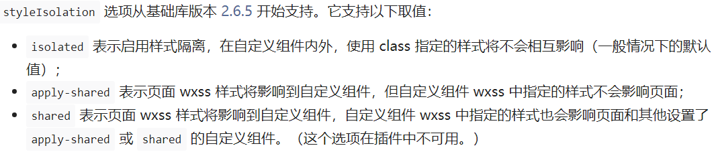
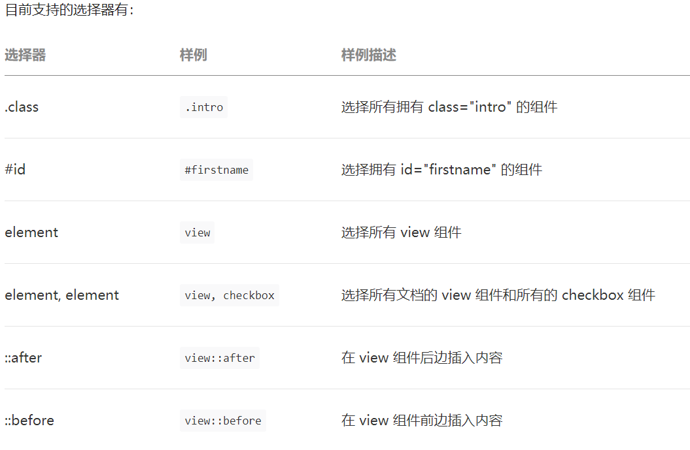

# 原生微信小程序开发经验总结

## 样式

### 全局样式

app.wxss中的样式会对所有页面生效，对组件不生效

> 在微信小程序中，区分页面和组件的依据是`是否配置在app.json的pages中`，并不是有由使用的构造器（Page/Component）决定的

因此，可以在app.wxss中放一些常用的预定义样式类；更好的做法是新建一个global.wxss然后在app.wxss中引入，这样组件也可以自主引入预定义样式

### 组件样式隔离

默认情况下，组件中的样式不会影响页面的样式，页面中的样式也无法影响组件样式

> app.wxss和引用组件的page中的标签选择器（其他特殊选择器）会影响到组件样式

可以通过styleIsolation选项改变组件的样式隔离



### 组件外部样式类

这是最推荐的改变组件样式的方法
在构造器中定义一组externalClasses，用法和properties类似，只不过外部样式传递的是样式，properties传递的是数据

## css选择器

### 页面选择器

小程序文档中只列出了6种支持的css选择器



但实际上常见的选择器基本都支持，下面列举些我在开发中用过，但是小程序文档没提的选择器

- 后代选择器
- 子代选择器
- 相邻选择器
- 兄弟选择器

### 组件选择器

小程序文档中明确指出了不能在组件中使用的样式，详见[组件模板和样式](https://developers.weixin.qq.com/miniprogram/dev/framework/custom-component/wxml-wxss.html)；主要就是以下4种

- #a { } /* 在组件中不能使用id选择器 */
- [a] { } /* 在组件中不能使用属性选择器 */
- button { } /* 在组件中不能使用标签选择器 */
- .a > .b { } /* 除非 .a 是 view 组件节点，否则不一定会生效 */

> 再强调下并不是在用Component构造的页面中有这些选择器的限制，而是对组件的限制

实际开发中，如果在组件中使用了这些选择器，在用真机调试的时候会有警告信息，但是样式的实际效果是不确定的，并不一定不生效；所以，最好还是在组建中避免使用这些选择器

## 自定义标题栏

使用自定义标题栏，除了可以自定义标题栏的样式外，还可以对页面路由进行更细粒度的控制，类似于路由钩子，而且在一些从诸如分享进入小程序的场景，默认的标题栏是无法回到首页的，如果是自定义标题栏就可以添加一个回到首页的按钮。

下面是一个标题栏自定义组件，其中`button=wx.getMenuButtonBoundingClientRect()`是右上角胶囊按钮的布局信息，`statusBarHeight=wx.getSystemInfoSync().statusBarHeight`是系统状态栏的高度。

```wxml
<view class="container c-nav" style="padding:{{button.top}}px calc(100% - {{button.left}}px) {{button.top-statusBarHeight}}px 0;">
  <act back="{{back}}" home="{{home}}" onBack="{{onBack}}" onHome="{{onHome}}"
    bind:back="onBack" bind:home="onHome"
  />
  <view class="title c-title" style="height:{{button.height}}px;line-height:{{button.height}}px;">{{title}}</view>
</view>
<view class="placeholder" style="height:{{button.height + 2*(button.top-statusBarHeight) + statusBarHeight}}px;" />
```

- 抽象节点和slot插槽

中间的`<act ... />`是一个自定义组件，它占据了抽象节点的默认位置，在调用的时候可以指定一个组件覆盖`act`组件，当然也可以不传就以`act`显示。

本来最好的方式是像下面这样用使用插槽。但是小程序不支持这种使用默认插槽的方式，抽象节点的方式虽然也能实现类似功能，但写起来很繁琐而且在指定抽象节点使用的组件时无法向组件传参。

```wxml
<view class="container c-nav" style="padding:{{button.top}}px calc(100% - {{button.left}}px) {{button.top-statusBarHeight}}px 0;">
  <slot>
    <-- act组件的内容 -->
    <view class="act {{(back || home)?'':'hidden'}} {{(!back && home)?'center':''}}" style="width:{{button.width}}px;height:{{button.height}}px;margin-left:calc(100vw - {{button.right}}px);">
      <image wx:if="{{back}}" bind:tap="back" class="img back" src="/images/left.svg" />
      <image wx:if="{{home}}" bind:tap="home" class="img home" src="/images/home.svg" />
    </view>
  </slot>
  <view class="title c-title" style="height:{{button.height}}px;line-height:{{button.height}}px;">{{title}}</view>
</view>
<view class="placeholder" style="height:{{button.height + 2*(button.top-statusBarHeight) + statusBarHeight}}px;" />
```

- 外部样式类

`c-nav`和`c-title`是预定义的2个外部样式类，需要在js中声明`externalClass`，在调用的时候可以指定一个外部类名覆盖组件内样式，但需要注意样式权重问题。

## 使用Promise

小程原生API不会返回promise，而是通过传递回调函数的方式处理结果。可以定义一个promisify方法，让原生API返回promise，类似于node.js中的util.promisify()方法。

```javascript
const promisify = function (func) {
  return function (param={}) {
    return new Promise((resolve, reject)=>{
      param.success = (res) => {
        resolve(res)
      }
      param.fail = (err) => {
        reject(err)
      }
      func(param)
    })
  }
}
```

### 定义全局异常处理

对wx.request()方法，除了要封装成promise外，还可以在顶层对请求结果做一次全局的异常处理（当然需要与后端定义好异常），以后的请求就可以不用考虑异常了。

## 关于Component和Page

小程序里定义一个页面可以使用Component或者Page构造器。Component构造器可以使用observers(相当于watch)、behaviors(相当于mixins),definitionFilter(定义段过滤器)，组合使用behaviors和definitionFilter还可以使用computed特性。而在Page构造器中可以使用onShareAppMessage()小程序的分享能力，还可以监听页面的下拉刷新、触底、滚动等事件。

我不是很明白为什么小程序要区分Component和Page两种构造页面的方式，更致命的是Component和Page分别有各自独特的能力，这就带给我很大的困扰，要选择一种就要丧失另外的能力。如果我希望同时使用behaviors和onShareAppMessage()就变得很麻烦，必须同时定义一个component和page，把逻辑都写在component里，在page里引入component。

## 一些少见但可能很有用的特性

### WXS函数绑定事件

### 互斥事件绑定 mut-bind

### 事件的捕获阶段

### mark 可以使用 mark 来识别具体触发事件的 target 节点

### 除继承样式外， app.wxss 中的样式、组件所在页面的的样式对自定义组件无效（除非更改组件样式隔离选项）

### 组件可以指定它所在节点的默认样式，使用 :host 选择器

### styleIsolation addGlobalClass

### 在同一个节点上使用普通样式类和外部样式类时，两个类的优先级是未定义的，因此最好避免这种情况

### 引用页面或父组件的样式

### 数据监听器

### 纯数据字段

### 抽象节点 componentGenerics

### 自定义组件扩展 修改自定义组件定义段的能力 Behavior computed watched

### 周期性更新
